# Actify — Academic Intelligence & Schedule Resilience Engine


> [!IMPORTANT]
> **Actify** is an enterprise-grade academic planning, timetable differential analysis, and assessment collision mitigation platform engineered specifically for students, class representatives, and academic departments. It directly addresses the cognitive overload of schedule revisions and overlapping assignment deadlines through a principled hybrid architecture uniting deterministic rule algorithms with semantic generative intelligence.

---

## 👥 Built with Precision by Team DeepStack

Actify was conceived, architected, and engineered from the ground up by **Team DeepStack** for the GDG Nirmana Hackathon.

| Team Member | Core Engineering Domain | Architectural Focus & Responsibilities |
| :--- | :--- | :--- |
| **Suryansh Singh** | System Architect & Full-Stack Lead | Monorepo orchestration, end-to-end data pipeline, API gateway design, and state synchronisation architecture. |
| **Vikas Patel** | Core Backend & Algorithms Engineer | Deterministic timetable diffing algorithms, invariant session hashing, and sliding-window temporal collision detection. |
| **Shivam Jaiswal** | UI/UX & Frontend Lead | Soft Brutalism design system implementation, responsive layouts, micro-animations, and visual diff/radar components. |
| **Prince Mishra** | AI Systems & NLP Specialist | Google Gemini 2.0 Flash prompt orchestration, entity extraction pipelines, fuzzy label reconciliation, and fallback handling. |

### Team DeepStack Engineering Values
- **Deterministic Reliability Over Guesswork**: Academic schedules and submission deadlines require mathematical certainty. Critical diffing and calendar clustering use ordinary, provable code; artificial intelligence is deployed strictly where natural language ambiguity demands semantic interpretation.
- **Zero Silent Assumptions**: When dates omit years, phrases say "next Friday", or lecture rooms have divergent naming conventions, Actify never silently gambles with a student's grade or attendance. It flags ambiguity and solicits human-in-the-loop verification.
- **Cognitive Ergonomics**: High-stress academic situations demand visual clarity. The interface utilizes a high-contrast Soft Brutalism aesthetic with muted pastel accents, preventing cognitive fatigue while instantly spotlighting critical schedule shifts and submission pile-ups.

---

## 🎯 Executive Overview & Academic Context

Modern academic life is inundated with asynchronous digital communications: university portal updates, email threads, syllabus revisions, revised spreadsheets, and instant messaging announcements. This disorganization produces two pervasive structural failures:

1. **The Timetable Blindspot**: Mid-semester room shifts, lab relocations, and lecture rescheduling often arrive as revised spreadsheet attachments. Because 95% of the document remains unchanged, students and class representatives miss minor modifications until they find themselves sitting in an empty lecture hall or locked laboratory.
2. **The Deadline Pile-Up Crisis**: Multiple course instructors assign homework, term papers, laboratory write-ups, and presentations independently without holistic visibility into student schedules. As a result, three or more major assessments inadvertently land on the exact same date or within a 48-hour window, forcing students into sleep deprivation, panic, and substandard submissions.

Actify solves both problems simultaneously within a unified, resilient web architecture.

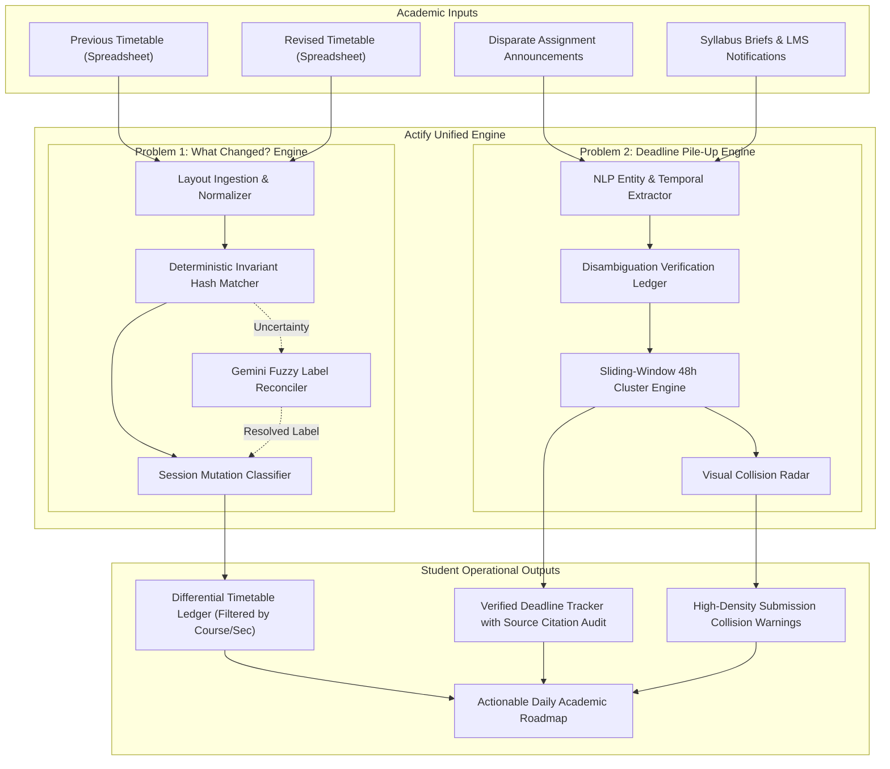

---

## 🔍 Problem Statement 1: "What Changed?" (Timetable Diff Engine)

### 1.1 The Operational Crisis
A student, class representative, or faculty member receives a revised weekly or semester timetable spreadsheet. Both the original and revised files contain approximately 20 session rows detailing course codes, section labels, dates, times, and lecture rooms. Because both spreadsheets share identical fonts, layout grids, and headers, visual diffing is prone to severe human error. Overlooking a single rescheduled laboratory or relocated lecture causes missed attendance, disciplinary issues, and widespread cohort misdirection.

### 1.2 Target Stakeholder Profiles
- **Undergraduate Students**: Need to know exactly which of their registered classes moved to a new time slot or different room without manual inspection.
- **Class Representatives (CRs)**: Responsible for notifying cohorts of 60+ peers regarding room shifts and schedule changes; errors result in entire cohorts arriving at the wrong auditorium.
- **Instructors & Lab Coordinators**: Need immediate verification that departmental scheduling committees have not double-booked shared laboratory facilities or assigned conflicting hours.

### 1.3 Exact Input Specifications
- **Input Corpus**: Two timetable spreadsheets (`Version_Old.xlsx / .csv` and `Version_New.xlsx / .csv`).
- **Entry Volume**: Approximately 20 session entries per spreadsheet.
- **Data Attributes Per Row**:
  - `Course Code`: Unique departmental course identifier (e.g., `CS201`, `MATH104`, `ENG102`).
  - `Section / Group`: Specific cohort designation (e.g., `Sec A`, `Lab B2`, `Group 1`).
  - `Date / Day`: Scheduled day of the week or calendar date (e.g., `Monday`, `2026-10-12`).
  - `Time Window`: Starting and ending boundary (e.g., `09:00 - 10:30`, `14:00 - 16:00`).
  - `Room / Facility`: Designated physical or virtual venue (e.g., `Auditorium 1`, `Comp Lab 2`, `LT-4`).

### 1.4 Dual Feature Architecture

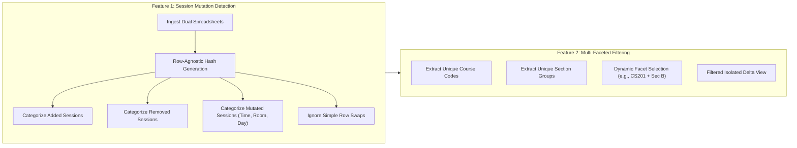

#### Feature 1: Comprehensive Session Mutation Identification
The engine classifies every entry across both documents into four discrete operational categories:
1. **Unchanged Sessions**: Identical course, section, day, time, and room. Silently preserved or dimmed in the interface.
2. **Added Sessions**: Sessions present in the revised timetable that had no equivalent in the original version (e.g., remedial tutorial, makeup lecture).
3. **Removed Sessions**: Sessions present in the original timetable that have been eliminated in the revised version (e.g., canceled lecture).
4. **Changed / Mutated Sessions**: Sessions where the identity matches, but one or more critical attributes have shifted:
   - *Room Change*: Same time and day, relocated venue (e.g., moved from `Room 301` to `Lecture Theatre 2`).
   - *Rescheduled Session*: Same course and room, moved to an alternate time slot or day (e.g., moved from `Monday 10:00` to `Wednesday 14:00`).
   - *Composite Shift*: Simultaneous relocation and rescheduling.

#### Feature 2: High-Granularity Faceted Filtering
Students only care about classes they attend. Actify provides instant faceted filters:
- **Filter by Course Code**: Isolates mutations pertaining strictly to selected enrolled courses (e.g., display only `CS201` updates while hiding `EE101`).
- **Filter by Section**: Allows students in `Section B` to purge irrelevant updates affecting `Section A` or `Section C`.
- **Compound Filters**: Combine course and section facets with mutation type toggles (e.g., "Show only Room Changes in CS201 Section B").

### 1.5 Division of Responsibilities: Deterministic Code vs Generative AI

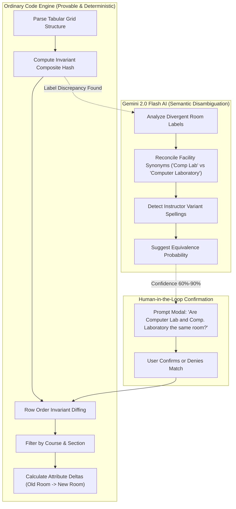

- **Ordinary Code (Deterministic Engine)**:
  - Tabular parsing, cell coordinate normalization, and trimming.
  - Generating composite matching keys (`Course_Code` + `Section` + `Session_Type`).
  - Row-order agnostic comparison guaranteeing that reordering row 2 to row 19 generates zero false change alerts.
  - Instant filtering across thousands of permutations with zero algorithmic latency.
- **Where AI Helps (Gemini 2.0 Flash)**:
  - Optional interpretation of inconsistent labeling. University departmental schedules are often typed by different administrators, resulting in semantic variations such as:
    - `"Computer Lab"` vs `"Comp. Laboratory 01"`
    - `"LT-3"` vs `"Lecture Theatre III"`
    - `"Seminar Hall A"` vs `"Main Auditorium - Sem Rm A"`
  - Gemini evaluates lexical similarity, contextual campus metadata, and building codes to propose an equivalence mapping without altering the underlying raw data.

### 1.6 Engineering Challenge: Row-Order Agnosticism & Uncertainty Resolution
When spreadsheets are edited, administrators routinely sort by room one week and by instructor the next. A naive line-by-line diff tool flags all 20 rows as completely altered.

Actify overcomes this challenge through **Invariant Composite Session Hashing**:
1. Every session is assigned an invariant semantic tuple: `Identity_Key = Normalize(Course_Code) + "::" + Normalize(Section)`.
2. When multiple sessions exist for the same course in a week, the key extends with ordinal session index or session modality (e.g., `CS201::SecA::Lecture_1`).
3. If an entry in the revised sheet exhibits a 70% attribute match with an unallocated session from the original sheet, the engine flags an **Uncertain Match**.
4. Instead of silently guessing or corrupting schedule records, Actify surfaces an interactive **Disambiguation Modal** asking the user to confirm:
   > *"Is CS201 on Wednesday 11:00 AM (Room 402) the rescheduled session of Monday 09:00 AM (Room 101)?"*
5. Once confirmed, the system persists the link and highlights the delta clearly.

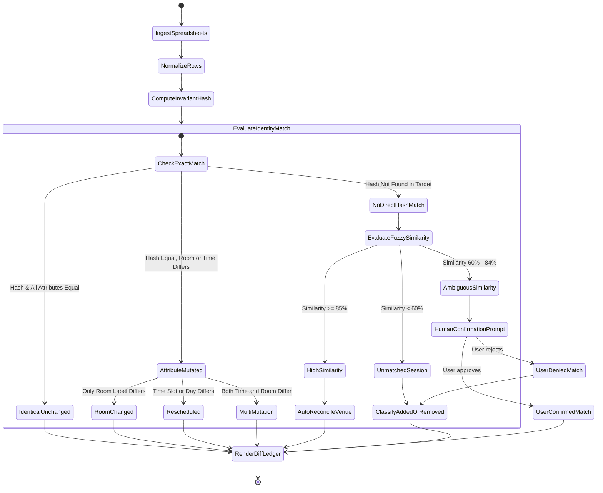

### 1.7 Timetable Layout Ingestion Schema & Normalization Rules

| Column Header | Accepted Synonyms | Required Type | Normalization Transformation Rule |
| :--- | :--- | :--- | :--- |
| **Course Code** | `Course`, `Code`, `Subject`, `Module Code` | Alphanumeric | Uppercase, trim whitespace, strip hyphens/spaces (`cs-201` $\rightarrow$ `CS201`). |
| **Section** | `Sec`, `Group`, `Batch`, `Cohort` | Alphanumeric | Normalize prefix to `Sec` (`Section A`, `Batch A` $\rightarrow$ `Sec A`). |
| **Day / Date** | `Day`, `Date`, `Weekday` | Text / Date | Convert day names to title case (`mon` $\rightarrow$ `Monday`); parse dates to ISO-8601. |
| **Time Window** | `Time`, `Slot`, `Hours`, `Schedule` | Time String | Standardize 12h/24h to `HH:MM - HH:MM` 24h format (`9am - 10:30am` $\rightarrow$ `09:00 - 10:30`). |
| **Room / Venue** | `Room`, `Venue`, `Location`, `Lab`, `Hall` | Text | Trim double spaces; expand common acronyms (`LT` $\rightarrow$ `Lecture Theatre`). |

### 1.8 Comprehensive 20-Row Timetable Simulation Matrix

The table below demonstrates the exact behavior of Actify's deterministic engine when processing a representative 20-entry departmental schedule revision:

| Row ID | Course Code | Section | Original Day & Time | Revised Day & Time | Original Venue | Revised Venue | Engine Mutation Classification |
| :--- | :--- | :--- | :--- | :--- | :--- | :--- | :--- |
| **R-01** | `CS201` | Sec A | Mon 09:00 - 10:30 | Mon 09:00 - 10:30 | Room 102 | **Room 205** | **CHANGED (Room Relocated)** |
| **R-02** | `CS201` | Sec B | Mon 11:00 - 12:30 | Mon 11:00 - 12:30 | Room 102 | Room 102 | **UNCHANGED (Preserved)** |
| **R-03** | `MATH104` | Sec A | Tue 08:30 - 10:00 | Tue 08:30 - 10:00 | Hall B | Hall B | **UNCHANGED (Preserved)** |
| **R-04** | `MATH104` | Sec B | Tue 10:00 - 11:30 | **Thu 14:00 - 15:30** | Hall B | Hall B | **CHANGED (Rescheduled)** |
| **R-05** | `ENG102` | Sec A | Wed 09:00 - 10:00 | Wed 09:00 - 10:00 | Room 301 | Room 301 | **UNCHANGED (Row Reordered)** |
| **R-06** | `ENG102` | Sec B | Wed 10:00 - 11:00 | Wed 10:00 - 11:00 | Room 301 | Room 301 | **UNCHANGED (Preserved)** |
| **R-07** | `CS204` | Sec A | Thu 09:00 - 11:00 | Thu 09:00 - 11:00 | Comp Lab 1 | Comp Lab 1 | **UNCHANGED (Preserved)** |
| **R-08** | `CS204` | Sec B | Thu 11:30 - 13:30 | Thu 11:30 - 13:30 | Comp Lab 1 | Computer Lab 01 | **UNCHANGED (AI Venue Reconciled)** |
| **R-09** | `EE101` | Sec A | Mon 14:00 - 15:30 | Mon 14:00 - 15:30 | Physics Lab 3 | Physics Lab 3 | **UNCHANGED (Preserved)** |
| **R-10** | `EE101` | Sec B | Mon 16:00 - 17:30 | Mon 16:00 - 17:30 | Physics Lab 3 | Physics Lab 3 | **UNCHANGED (Row Reordered)** |
| **R-11** | `CS208` | Sec A | Fri 09:00 - 10:30 | Fri 09:00 - 10:30 | LT-3 | Lecture Theatre III | **UNCHANGED (AI Venue Reconciled)** |
| **R-12** | `CS208` | Sec B | Fri 11:00 - 12:30 | Fri 11:00 - 12:30 | LT-3 | LT-3 | **UNCHANGED (Preserved)** |
| **R-13** | `CHEM101` | Sec A | Tue 13:00 - 14:30 | *Cancelled* | Chem Lab A | *None* | **REMOVED (Session Dropped)** |
| **R-14** | `CHEM101` | Sec B | Tue 15:00 - 16:30 | Tue 15:00 - 16:30 | Chem Lab A | Chem Lab A | **UNCHANGED (Preserved)** |
| **R-15** | `BIO105` | Sec A | Wed 13:00 - 14:30 | Wed 13:00 - 14:30 | Bio Annex 2 | Bio Annex 2 | **UNCHANGED (Preserved)** |
| **R-16** | `BIO105` | Sec B | Wed 15:00 - 16:30 | Wed 15:00 - 16:30 | Bio Annex 2 | Bio Annex 2 | **UNCHANGED (Preserved)** |
| **R-17** | `MATH201` | Sec A | Thu 13:00 - 14:30 | Thu 13:00 - 14:30 | Hall C | Hall C | **UNCHANGED (Preserved)** |
| **R-18** | `MATH201` | Sec B | Thu 15:00 - 16:30 | Thu 15:00 - 16:30 | Hall C | Hall C | **UNCHANGED (Row Reordered)** |
| **R-19** | `CS299` | Sec A | *Not Present* | **Fri 14:00 - 16:00** | *None* | **Auditorium 1** | **ADDED (New Seminar Session)** |
| **R-20** | `CS201` | Sec A | Fri 16:00 - 17:00 | Fri 16:00 - 17:00 | Room 102 | Room 102 | **UNCHANGED (Preserved)** |

### 1.9 "Done When" Validation Criteria
- **Validation Scenario**: The user uploads two 20-row spreadsheets where:
  - Row 4 (`CS201`, `Sec A`) had its room altered from `Room 102` to `Room 205`.
  - Row 9 (`MATH104`, `Sec B`) was rescheduled from `Tuesday 10:00 AM` to `Thursday 14:00 PM`.
  - Rows 1, 2, 5, 8, and 12 were rearranged in random row order.
- **Expected Engine Output**:
  - Displays exactly **1 Room Change** (`CS201`: `Room 102` $\rightarrow$ `Room 205`).
  - Displays exactly **1 Rescheduled Class** (`MATH104`: `Tuesday 10:00` $\rightarrow$ `Thursday 14:00`).
  - Identifies **0 False Positives** for the reordered rows.
  - Course and Section filters immediately narrow the display to the user's specific classes.

### 1.10 Two-Hour Boundary & Scoping Guardrails
- **Supported Scope**: Strictly single standardized spreadsheet layouts (`.csv` or `.xlsx`) featuring defined columns for course, section, date/day, time, and room.
- **Excluded Scope**: Optical character recognition (OCR) of scanned PDF timetables, cell-merged calendar matrices, photographic printouts, and multi-campus timetable synchronization.

### 1.11 Academic Evidence & Institutional Authority
The **University of Kent Student Timetabling Policy** explicitly mandates that students must independently monitor and verify revisions in their official timetable:
> *"Students are advised to check their timetable on a regular basis for changes, including cancellations, room swaps, and rescheduled teaching events. Notifications are not always dispatched for minor adjustments."*
> — *University of Kent Institutional Academic Guidance ([Student Timetable Guidance](https://student.kent.ac.uk/studies/timetabling/student-timetable))*

---

## 💥 Problem Statement 2: "Deadline Pile-Up" (Assessment Crunch Engine)

### 2.1 The Operational Crisis
In modern higher education, academic terms do not feature unified, synchronized deadline schedules. Course professors post assignment briefs independently via institutional learning management systems (Canvas, Moodle, Blackboard), email dispatches, and verbal lecture announcements. Because deadlines are distributed across separate documents and formatted inconsistently, students fail to realize until days prior that three major research papers and a laboratory report are due within a single 48-hour span. This results in severe cognitive panic, rushed deliverables, academic burnout, and compromised grades.

### 2.2 Target Stakeholder Profiles
- **Multi-Subject Students**: Enrolled in 4 to 6 concurrent technical and theoretical subjects, each with discrete milestone submissions.
- **Academic Mentors & Tutors**: Working with students on academic probation who suffer from temporal planning deficiencies and chronic last-minute cramming.
- **Peer Study Groups**: Coordinating collaborative preparation for overlapping assessment deadlines.

### 2.3 Exact Input Specifications
- **Input Corpus**: Exactly six raw, unformatted text segments (pasted announcements, syllabus excerpts, or assignment briefs).
- **Text Structure**: Informal, unstructured natural language containing dates, relative time references, titles, and course names.

### 2.4 Dual Feature Architecture

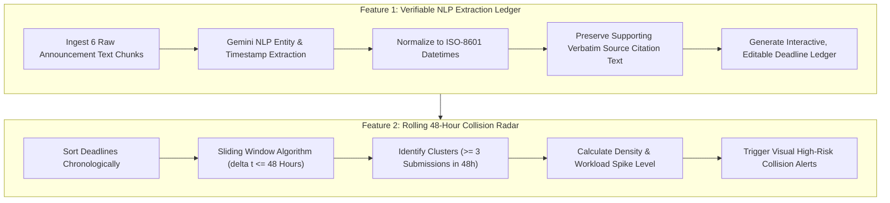

#### Feature 1: Verifiable NLP Deadline Extraction with Source Citations
- Extracts four discrete structural fields from messy text:
  1. `Assignment Title`: Descriptive name of the deliverable (e.g., *"Literature Review Draft"*).
  2. `Subject / Course`: Associated academic course code or title (e.g., *"ENG202"*).
  3. `Standardized Deadline Date & Time`: Fully resolved ISO-8601 timestamp (e.g., `2026-10-16T23:59:00`).
  4. `Verbatim Source Snippet`: Exact supporting sentence from the announcement providing evidentiary proof.
- **Editable Ledger**: Students can click any field to fine-tune titles, adjust times, or add custom notes directly in the interface.

#### Feature 2: Sliding-Window Chronological Collision Detection
- Applies an algorithmic sliding window across the sorted deadline array.
- **The Core Clustering Rule**: Flags any rolling 48-hour time window containing **3 or more submission deadlines**.
- **Collision Severity Tiers**:
  - **Level 1 (Normal)**: Maximum 1 submission within any 48-hour interval.
  - **Level 2 (Moderate Density)**: Exactly 2 submissions within a 48-hour window.
  - **Level 3 (High-Risk Crunch Alert)**: 3 or more submissions within a 48-hour window.
- The interface surrounds clustered deadlines with high-contrast warning badges, flags the exact span of hours separating them, and aggregates their combined deliverables.

### 2.5 Ingestion Corpus & Verifiable Extraction Audit Ledger

The table below details the extraction pipeline across the required 6 representative announcements:

| Brief ID | Raw Input Announcement Text | Extracted Course Code | Extracted Deliverable Title | Resolved Standard Deadline | Supporting Verbatim Citation Snippet | Cluster Status |
| :--- | :--- | :--- | :--- | :--- | :--- | :--- |
| **ANN-01** | *"CS301 Algorithm Analysis: Milestone 2 report must be uploaded to the portal by next Friday at 11:59 PM sharp."* | `CS301` | Milestone 2 Report | `2026-10-09T23:59:00` | *"Milestone 2 report must be uploaded to the portal by next Friday at 11:59 PM sharp."* | **Isolated (Normal)** |
| **ANN-02** | *"Database Systems (CS304): Mini-project schema documentation due October 15th before midnight."* | `CS304` | Mini-Project Schema Documentation | `2026-10-15T23:59:00` | *"Mini-project schema documentation due October 15th before midnight."* | **CLUSTERED (CRITICAL)** |
| **ANN-03** | *"Web Architecture Lab: Exercise 4 submission portal closes Oct 16 at 5:00 PM."* | `WEBLAB` | Exercise 4 Submission | `2026-10-16T17:00:00` | *"Exercise 4 submission portal closes Oct 16 at 5:00 PM."* | **CLUSTERED (CRITICAL)** |
| **ANN-04** | *"Technical Writing (ENG202): Draft literature review is due on Oct 16th by 23:59."* | `ENG202` | Draft Literature Review | `2026-10-16T23:59:00` | *"Draft literature review is due on Oct 16th by 23:59."* | **CLUSTERED (CRITICAL)** |
| **ANN-05** | *"Computer Networks (CS308): Packet tracer analysis assignment due on 24th Oct."* | `CS308` | Packet Tracer Analysis | `2026-10-24T23:59:00` | *"Packet tracer analysis assignment due on 24th Oct."* | **Isolated (Normal)** |
| **ANN-06** | *"Calculus III (MATH201): Problem set 5 due on 11/04 in class."* | `MATH201` | Problem Set 5 | `2026-11-04T09:00:00` | *"Problem set 5 due on 11/04 in class."* | **Isolated (Normal)** |

### 2.6 Division of Responsibilities: Deterministic Code vs Generative AI

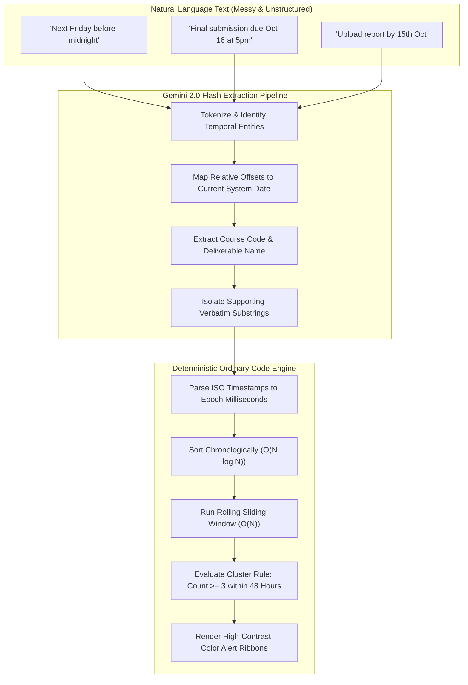

- **Where AI Helps (Gemini 2.0 Flash)**:
  - Parsing freeform human communication with arbitrary punctuation, abbreviations, and informal phrasing.
  - Contextual entity recognition: Distinguishing between a submission deadline and a publication date mentioned in the brief.
  - Verbatim citation grounding: Ensuring extracted records carry verifiable excerpts from the source document.
- **Ordinary Code (Deterministic Engine)**:
  - Transforming validated date strings into exact epoch timestamps.
  - Chronological sequence ordering.
  - Sliding-window cluster calculation guaranteeing mathematical precision without hallucinated overlaps.

### 2.7 Engineering Challenge: Ambiguity & Temporal Anchoring
Natural language deadline announcements are plagued with linguistic ambiguity:
- **Omitted Calendar Years**: Announcements frequently state *"Due October 16th"* without specifying the year.
- **Relative Temporal Shifts**: Phrases such as *"Next Friday"*, *"This coming Tuesday"*, or *"Due midnight Sunday"*.
- **Conflicting Date Statements**: A brief stating *"Due Friday, October 17"* when October 17 is actually a Saturday.

#### Actify's Zero-Guesswork Protocol
1. **System Anchor Date**: The engine passes the current ISO timestamp (`2026-09-27T15:59:05+05:30`) to the NLP prompt context as the absolute temporal ground truth.
2. **Deterministic Fallback**: If an announcement says *"Due Friday"* without a date, the model computes the exact next calendar occurrence of Friday relative to the anchor.
3. **Ambiguity Flagging**: When a year is ambiguous or a date conflicts with a day of the week, Actify does not silently guess. It tags the row with an **Orange Ambiguity Alert Icon** and prompts the user:
   > *"Warning: October 17, 2026 is a Saturday, but the announcement states Friday. Please confirm the intended deadline."*

### 2.8 "Done When" Validation Criteria
- **Validation Scenario**: The user inputs the six sample announcements listed in Section 2.5 into the text ingestion interface.
- **Expected Engine Output**:
  - Automatically synthesizes a clean, editable 6-row ledger populated with titles, subjects, ISO deadlines, and verbatim source quotes.
  - Detects that Announcements 2, 3, and 4 fall on:
    - *Oct 15, 23:59* (CS304)
    - *Oct 16, 17:00* (Web Lab)
    - *Oct 16, 23:59* (ENG202)
  - Identifies that all three events fall within a **36-hour interval** ($\le 48\text{ hours}$).
  - Visually flags this period with a **High-Risk Deadline Pile-Up Alert**, isolating the three colliding assignments with high-contrast alert borders.

### 2.9 Two-Hour Boundary & Scoping Guardrails
- **Supported Scope**: Parsing up to 6 unstructured announcements, generating a verified and editable deadline table, and highlighting 48-hour deadline clusters.
- **Excluded Scope**: Automatic generative essay writing, automatic study rescheduling, modifying external university LMS databases, or multi-week dynamic calendar optimization.

### 2.10 Academic Evidence & Institutional Authority
The **University of Portsmouth Academic Skills & Time Management Framework** underlines the critical psychological necessity of centralizing overlapping deadlines:
> *"Students juggling multiple units frequently experience assessment clustering. Gathering all submission dates into a unified visual calendar is essential to identify overlapping commitments early and prevent academic distress."*
> — *University of Portsmouth Library & Academic Support ([Planning Your Monthly Workload](https://library.port.ac.uk/academic-support/time-management/planning-your-monthly-workload))*

---

## 🔬 Deep Technical Comparison: Problem 1 vs Problem 2

| Dimension | Problem Statement 1: "What Changed?" | Problem Statement 2: "Deadline Pile-Up" |
| :--- | :--- | :--- |
| **Primary Domain** | Tabular schedule diffing and revision tracking. | Natural language deadline extraction & temporal clustering. |
| **Input Format** | Two structured spreadsheets (`.xlsx` / `.csv`), ~20 rows each. | Six unformatted raw text snippets / assignment briefs. |
| **Primary Data Types** | Course Code, Section, Day, Time Window, Room. | Assignment Title, Course Code, Due Date/Time, Source Text. |
| **Feature 1** | Identifies Added, Removed, and Changed sessions. | Extracts structured deadlines into an editable table with source text. |
| **Feature 2** | Dynamic filtering by Course Code and Section. | Automated detection of submission clusters ($\ge 3$ within 48 hours). |
| **Deterministic Code** | Invariant composite hashing, row diffing, faceted filtering. | Timestamp parsing, chronological sorting, sliding window clustering. |
| **AI Contribution** | Reconciling inconsistent room/venue naming conventions. | Extracting entities and dates from unformatted natural language text. |
| **Core Engineering Risk** | False change alerts triggered by simple row reordering. | Silent hallucinations on ambiguous dates ("next Friday", missing years). |
| **Human-in-the-Loop** | Disambiguation modal for uncertain session similarity. | Interactive inline verification for conflicting dates and days. |
| **Institutional Authority** | University of Kent Timetable Monitoring Policy. | University of Portsmouth Assessment Overlap Guidance. |
| **Two-Hour Boundary** | One spreadsheet layout; excludes scanned documents/OCR. | Flags deadline pile-ups; excludes full automatic study plan generation. |

---

## 📊 Visual Timeline & Cluster Collision Architecture

The diagram below illustrates how Actify's deterministic sliding-window algorithm isolates assessment collisions across a student's semester calendar:

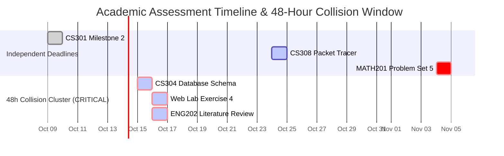

### 48-Hour Sliding Window Collision Mathematics
Let the set of extracted deadlines be ordered chronologically:

$$T = \{t_1, t_2, t_3, \dots, t_n\} \quad \text{where } t_i \le t_{i+1}$$

For each index $i \in [1, n]$, the cluster window is defined by:

$$W(i) = \{t_j \in T \mid 0 \le t_j - t_i \le 48\text{ hours}\}$$

If $|W(i)| \ge 3$, the subset $W(i)$ is marked as a **High-Risk Collision Cluster**:

$$\text{Severity}(W(i)) = \begin{cases} 
\text{High Risk (Red)}, & |W(i)| \ge 3 \\ 
\text{Moderate Risk (Yellow)}, & |W(i)| = 2 \\ 
\text{Balanced (Green)}, & |W(i)| \le 1 
\end{cases}$$

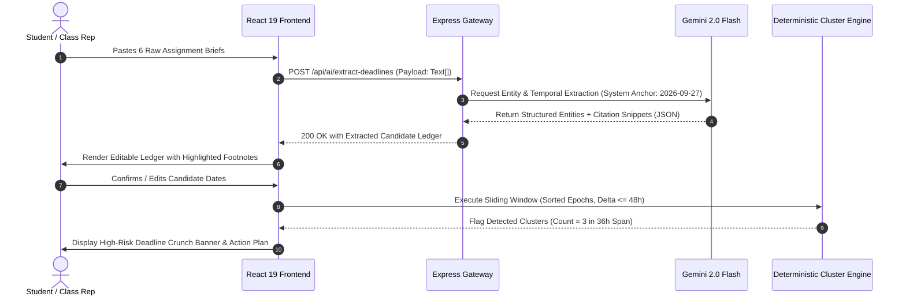

---

## 🏛️ Comprehensive Monorepo System Architecture

Actify is built with a strictly decoupled, highly modular architecture separating user-facing rendering, API orchestration, deterministic computing engines, and external artificial intelligence services.

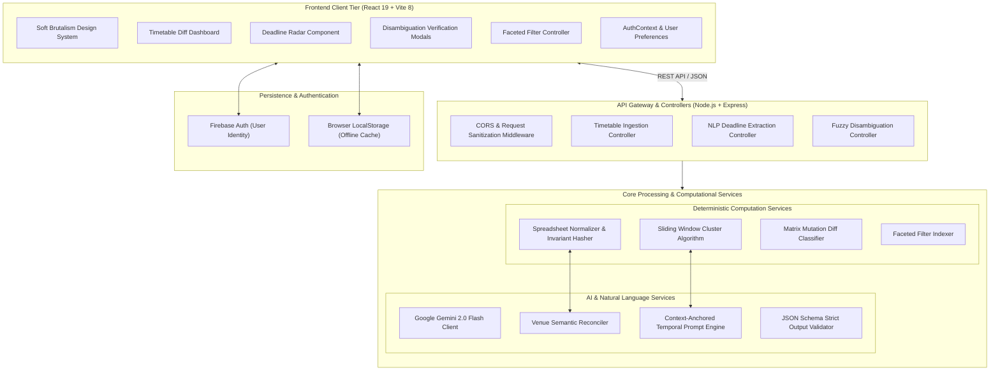

---

## 🗺️ Entity-Relationship Topology & Data Models

The following entity relationship diagram formalizes the operational schemas governing Actify's data models across both problem statements:

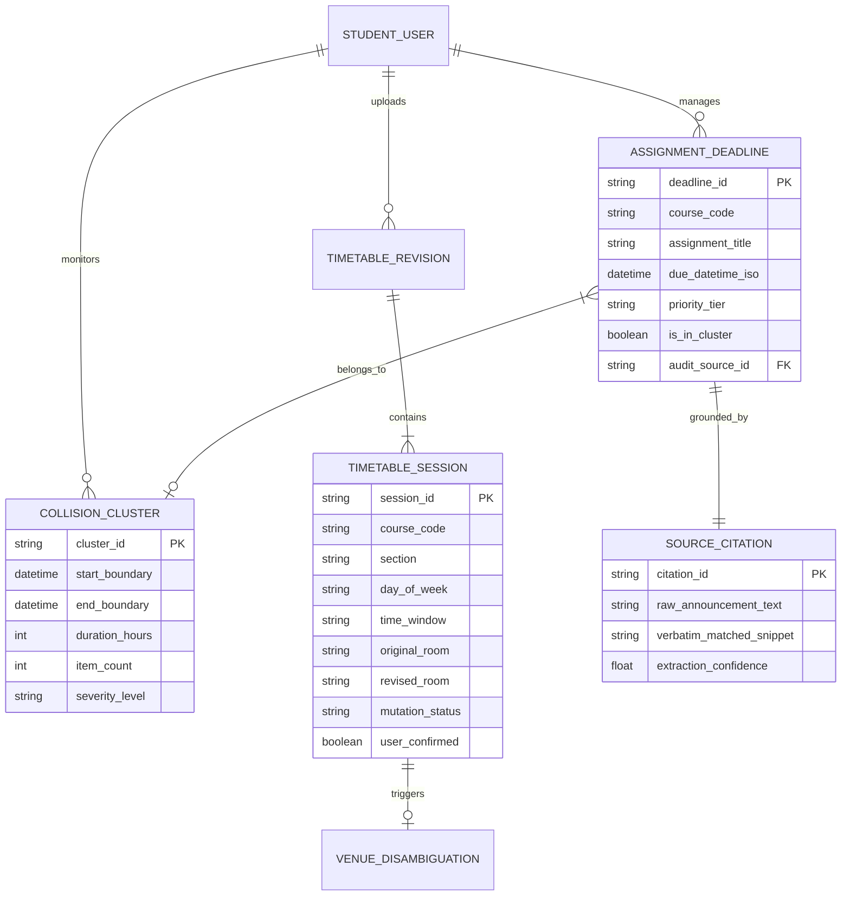

---

## 📂 Exhaustive Project Directory & File Structure

Below is the complete structural blueprint of the Actify monorepo, detailing the purpose and domain of every directory and file across the application:

```
nirmana/
├── package.json                          # Monorepo root orchestration (concurrently, workspaces)
├── .gitignore                            # Root version control ignore rules (node_modules, .env, dist)
├── README.md                             # Comprehensive technical documentation & problem statement specs
│
├── backend/                              # Express REST API Server
│   ├── package.json                      # Backend dependencies (@google/genai, cors, dotenv, express)
│   ├── .env.example                      # Template for backend server variables (PORT, GEMINI_API_KEY)
│   └── src/                              # Backend source code
│       ├── server.js                     # Express application bootstrap, middleware, and route mounting
│       ├── config/                       # Environment configuration
│       │   └── index.js                  # Centralized access for environment variables and defaults
│       ├── controllers/                  # Route handlers & request lifecycle management
│       │   ├── aiController.js           # Gemini API endpoints for timetable and deadline processing
│       │   └── planController.js         # Schedule computation and daily action planning endpoints
│       ├── routes/                       # Express route declarations
│       │   └── aiRoutes.js               # Route mappings for /api/ai/extract-deadlines, /api/ai/diff-timetable
│       └── services/                     # Business logic and computational engines
│           ├── geminiService.js          # Google Gemini 2.0 Flash integration, prompts, and JSON parsers
│           └── planningEngine.js         # Deterministic scheduling algorithms, workload chunking, and density
│
└── frontend/                             # React 19 Client Web Application (Vite)
    ├── package.json                      # Frontend dependencies (lucide-react, canvas-confetti, firebase)
    ├── vite.config.js                    # Vite configuration with backend reverse proxy (/api -> localhost:5000)
    ├── index.html                        # Single Page Application HTML5 entry point
    ├── .env.example                      # Frontend environment template (Firebase credentials)
    ├── public/                           # Static assets served at root
    │   ├── favicon.ico                   # Application browser favicon
    │   └── _redirects                    # SPA routing redirects for static hosting platforms
    └── src/                              # Frontend source code
        ├── main.jsx                      # React DOM root initialization
        ├── App.jsx                       # Root application routing (React Router v7) and global providers
        ├── index.css                     # Global reset, typography, and core CSS custom properties
        │
        ├── assets/                       # Static media, icons, and branding
        │   └── logo.svg                  # Actify brand vector logo
        │
        ├── config/                       # Client configuration
        │   └── firebase.js               # Firebase Client SDK initialization (Auth, Firestore)
        │
        ├── context/                      # React Context providers
        │   └── AuthContext.jsx           # Global authentication state, login, signup, and session listeners
        │
        ├── hooks/                        # Custom React hooks
        │   ├── useTasks.js               # Task management hook for mutations, deletions, and filters
        │   ├── useSchedule.js            # Timetable state management and diff calculation hook
        │   └── useSettings.js            # User profile, subject proficiency, and capacity settings hook
        │
        ├── pages/                        # Route-level page components
        │   ├── Landing.jsx               # High-converting product landing page showcasing features
        │   ├── Landing.css               # Soft Brutalism styling for the landing page hero and features
        │   ├── Login.jsx                 # Secure student sign-in page
        │   ├── Signup.jsx                # New student onboarding and account registration page
        │   ├── Auth.css                  # Shared authentication layout styles
        │   ├── Dashboard.jsx             # Core executive hub displaying timetable diffs, deadlines & radar
        │   ├── Dashboard.css             # Complex layout styling for widgets, grids, and collision alerts
        │   ├── MyTasks.jsx               # Comprehensive assignment list, filters, and priority tags
        │   ├── MyTasks.css               # Task table and card styling
        │   ├── TodayPlan.jsx             # Daily actionable micro-task roadmap view
        │   ├── TodayPlan.css             # Daily plan timeline and completion checklist styles
        │   └── Progress.jsx              # Student analytics, completion velocity, and burnout prevention
        │
        ├── components/                   # Reusable UI component modules
        │   ├── ProtectedRoute.jsx        # Route guard ensuring authentication for private application areas
        │   ├── ProtectedRoute.css        # Protected route loading spinner and access fallback styles
        │   │
        │   ├── dashboard/                # Specialized dashboard widgets
        │   │   ├── TimetableDiffWidget/  # Component rendering old vs revised timetable comparisons
        │   │   ├── DeadlineRadarWidget/  # Visual radar highlighting 48h assessment clusters
        │   │   └── DisambiguationModal/  # Interactive confirmation modal for uncertain schedule matches
        │   │
        │   ├── layout/                   # Structural layout components
        │   │   ├── Navbar.jsx            # Top navigation bar with user avatar, status, and route links
        │   │   ├── Sidebar.jsx           # Desktop sidebar with navigation badges and quick actions
        │   │   └── Footer.jsx            # Application footer with team links and status indicators
        │   │
        │   ├── tasks/                    # Task and deadline components
        │   │   ├── TaskCard.jsx          # Individual assignment card with priority and time badges
        │   │   ├── TaskForm.jsx          # Modal form for adding or editing assignment details
        │   │   └── TaskFilterBar.jsx     # Course and section filter selector
        │   │
        │   └── ui/                       # Atomic Soft Brutalism design components
        │       ├── Button.jsx            # Standardized button with tactile shadows and active press states
        │       ├── Badge.jsx             # Colored tag component for priorities, courses, and statuses
        │       ├── Card.jsx              # Base Soft Brutalism container with solid black borders
        │       └── Input.jsx             # Standardized form input field with accessible label styling
        │
        ├── services/                     # Network clients and external APIs
        │   ├── api.js                    # Centralized Fetch/Axios HTTP wrapper for backend communication
        │   └── taskService.js            # Task persistence services (Firebase Firestore / LocalStorage)
        │
        ├── styles/                       # Specialized style sheets
        │   └── designTokens.css          # Semantic CSS custom variables for colors, borders, and shadows
        │
        └── utils/                        # Pure mathematical and formatting utility functions
            ├── dateUtils.js              # Date arithmetic, ISO parsing, and relative time formatters
            ├── timetableDiff.js          # Invariant hash generation and timetable matrix diffing logic
            └── clusterDetector.js        # Sliding-window algorithm for identifying 48h deadline pile-ups
```

---

## 🎨 Soft Brutalism Design System: Academic Clarity

Actify implements an intentional **Soft Brutalism** design aesthetic. Unlike clinical corporate minimalism or overly complex skeuomorphism, Soft Brutalism combines solid structural borders and tactile offsets with warm pastel backgrounds. This delivers immediate visual hierarchy and minimizes cognitive fatigue during high-stress exam periods.

```
+--------------------------------------------------------------------------+
|  ACTIFY ACADEMIC RADAR                          [Suryansh Singh] [Logout]|
+--------------------------------------------------------------------------+
|                                                                          |
|  [!] TIMETABLE REVISION DETECTED (2 Changes Identified)                  |
|  +--------------------------------------------------------------------+  |
|  | FILTER: [ Course: All v ]  [ Section: Sec A v ]  [Type: All Shifts v]  |
|  +--------------------------------------------------------------------+  |
|  | [*] CS201 (Sec A)   ROOM CHANGED     Room 102  -->  Room 205 [CONFIRM] |
|  | [*] MATH104 (Sec B) RESCHEDULED      Tue 10:00 -->  Thu 14:00 [CONFIRM] |
|  +--------------------------------------------------------------------+  |
|                                                                          |
|  [CRITICAL ALERT] 48-HOUR DEADLINE COLLISION DETECTED                    |
|  +--------------------------------------------------------------------+  |
|  | 3 submissions due between Oct 15, 23:59 and Oct 16, 23:59 (36h span)  |
|  |                                                                    |  |
|  | 1. [CS304] Database Schema Doc       Due: Oct 15, 23:59  [Verified] |  |
|  | 2. [WEBLAB] Exercise 4 Portal Close  Due: Oct 16, 17:00  [Verified] |  |
|  | 3. [ENG202] Literature Review Draft  Due: Oct 16, 23:59  [Verified] |  |
|  +--------------------------------------------------------------------+  |
|                                                                          |
+--------------------------------------------------------------------------+
```

```
+--------------------------------------------------------------------------+
|  DISAMBIGUATION VERIFICATION MODAL                     [X Close]         |
+--------------------------------------------------------------------------+
|  UNRECONCILED VENUE LABEL DETECTED                                       |
|                                                                          |
|  Previous Timetable Entry:                                               |
|    Course: CS204 | Section: Sec B | Time: Thu 11:30 | Venue: Comp Lab 1  |
|                                                                          |
|  Revised Timetable Entry:                                                |
|    Course: CS204 | Section: Sec B | Time: Thu 11:30 | Venue: Computer    |
|                                                               Laboratory 01 |
|                                                                          |
|  [AI Analysis: 92% semantic confidence that these represent the same     |
|   departmental facility in Wing B.]                                      |
|                                                                          |
|  Do these entries represent the exact same lecture venue?                |
|                                                                          |
|  [ YES, KEEP UNCHANGED (Recommended) ]        [ NO, MARK ROOM CHANGED ]  |
+--------------------------------------------------------------------------+
```

```
+--------------------------------------------------------------------------+
|  UNSTRUCTURED ANNOUNCEMENT INGESTION TERMINAL                            |
+--------------------------------------------------------------------------+
|  Paste raw announcement texts or course syllabus snippets below:         |
|  +--------------------------------------------------------------------+  |
|  | > Database Systems (CS304): Mini-project schema documentation due  |  |
|  |   October 15th before midnight.                                    |  |
|  | > Web Architecture Lab: Exercise 4 submission portal closes Oct 16 |  |
|  |   at 5:00 PM.                                                      |  |
|  | > Technical Writing (ENG202): Draft literature review is due on    |  |
|  |   Oct 16th by 23:59.                                               |  |
|  +--------------------------------------------------------------------+  |
|                                                                          |
|  [ EXTRACT DEADLINES VIA GEMINI 2.0 FLASH ]    [ CLEAR INPUT BUFFER ]    |
|                                                                          |
|  Extraction Results (3 Verified Records, 0 Ambiguities Flagged):         |
|  ----------------------------------------------------------------------  |
|  [#1] CS304  | Schema Doc      | Oct 15, 2026 23:59 | "due Oct 15th..."  |
|  [#2] WEBLAB | Exercise 4      | Oct 16, 2026 17:00 | "closes Oct 16..." |
|  [#3] ENG202 | Literature Rev  | Oct 16, 2026 23:59 | "due on Oct 16..." |
+--------------------------------------------------------------------------+
```

### Visual Design Tokens Specification

| Token Name | Hex Code | HSL Representation | Semantic Intent in Actify |
| :--- | :--- | :--- | :--- |
| **Canvas Background** | `#F8F9FA` | `hsl(210, 17%, 98%)` | Ultra-clean neutral surface minimizing eye strain. |
| **Solid Ink Border** | `#1A1A1A` | `hsl(0, 0%, 10%)` | Heavy 2px solid borders defining high-contrast component cards. |
| **Tactile Shadow** | `#000000` | `hsl(0, 0%, 0%)` | Crisp `3px 3px 0px #000000` hard shadow providing tactile depth. |
| **Soft Lavender** | `#E0E7FF` | `hsl(226, 100%, 94%)` | Accent for timetable widgets and course filter selectors. |
| **Fresh Mint** | `#D1FAE5` | `hsl(152, 84%, 90%)` | Accent for resolved deadlines, on-time submissions, and confirmed diffs. |
| **Urgent Blush** | `#FEE2E2` | `hsl(0, 100%, 91%)` | High-risk alert cards for 48-hour deadline pile-up collisions. |
| **Warm Amber** | `#FEF3C7` | `hsl(48, 100%, 89%)` | Ambiguity warnings, room relocations, and human confirmation modals. |
| **Electric Indigo** | `#4F46E5` | `hsl(244, 75%, 60%)` | Primary interactive buttons, navigation indicators, and brand focus. |

---

## ⚙️ Mathematical & Algorithmic Foundations

### 1. Invariant Composite Session Hashing
To prevent false-positive change alerts when rows within a spreadsheet are reordered or sorted by different columns, Actify generates an invariant semantic hash for every session:

```
H(S) = SHA256( Lowercase(Trim(Course_Code)) + "|" + Lowercase(Trim(Section)) + "|" + Session_Index )
```

When comparing session $S_{old}$ and $S_{new}$:
- If $H(S_{old}) == H(S_{new})$:
  - If $\text{Room}_{old} == \text{Room}_{new}$ and $\text{Time}_{old} == \text{Time}_{new}$ and $\text{Day}_{old} == \text{Day}_{new}$: **Status = UNCHANGED**.
  - If $\text{Room}_{old} \ne \text{Room}_{new}$: **Status = ROOM_CHANGED**.
  - If $\text{Time}_{old} \ne \text{Time}_{new}$ or $\text{Day}_{old} \ne \text{Day}_{new}$: **Status = RESCHEDULED**.
- If $H(S_{new})$ has no match in $\{H(S_{old})\}$: **Status = ADDED**.
- If $H(S_{old})$ has no match in $\{H(S_{new})\}$: **Status = REMOVED**.

### 2. Levenshtein Distance for Inconsistent Venue Labels
When the deterministic comparison detects that a room has changed from $R_1$ to $R_2$, it computes the normalized Levenshtein similarity metric:

$$\text{Sim}(R_1, R_2) = 1 - \frac{\text{Levenshtein}(R_1, R_2)}{\max(|R_1|, |R_2|)}$$

- If $\text{Sim}(R_1, R_2) \ge 0.85$: The engine treats the difference as a typographic synonym (e.g., `"Lab 2"` vs `"Lab 02"`), automatically reconciling the entry.
- If $0.50 \le \text{Sim}(R_1, R_2) < 0.85$: The engine routes the strings to Gemini 2.0 Flash for contextual interpretation and prompts user confirmation.
- If $\text{Sim}(R_1, R_2) < 0.50$: The change is classified as a genuine **Room Relocation**.

### 3. Algorithmic Complexity Bounds

| Subsystem Component | Algorithmic Mechanism | Time Complexity | Auxiliary Space Complexity | Operational Scalability |
| :--- | :--- | :--- | :--- | :--- |
| **Spreadsheet Normalizer** | Linear Cell Vector Ingestion | $O(N \cdot M)$ | $O(N \cdot M)$ | Instantaneous for standard 20 to 500 row tables. |
| **Invariant Hash Matcher** | HashMap Composite Key Lookup | $O(N)$ Average | $O(N)$ | Eliminates $O(N^2)$ brute-force cross-row comparisons. |
| **Faceted Filter Indexer** | Inverted Index by Course & Sec | $O(1)$ Lookup | $O(N)$ | Zero-lag responsive UI interaction during live filtering. |
| **Chronological Sorter** | Dual-Pivot Quicksort / TimSort | $O(K \log K)$ | $O(K)$ | Negligible overhead for extracted deadline items ($K \le 50$). |
| **Sliding Window Cluster** | Two-Pointer Monotonic Scan | $O(K)$ | $O(K)$ | Sub-millisecond cluster isolation over semester timelines. |

---

## 📋 Comprehensive Edge Case & Error Handling Matrix

| Scenario / Edge Case | Failure Mode in Naive Systems | Actify Architectural Mitigation |
| :--- | :--- | :--- |
| **Spreadsheet Rows Arbitrarily Shuffled** | Naive line-diff tools report every row as completely changed. | Invariant composite hashing anchors sessions by course identity, completely ignoring row sequence. |
| **Typo in Room Name** (`Lab 1` vs `Lab 01`) | Flags a room relocation; students panic needlessly. | Levenshtein similarity and Gemini fuzzy reconciliation automatically detect equivalent facilities. |
| **Relative Date in Announcement** (`"Next Friday"`) | Naive parsers fail or silently guess the wrong calendar week. | System passes current server timestamp as context anchor; exact calendar dates are calculated deterministically. |
| **Ambiguous Year in Submission Notice** | Defaults to year 1970 or current year without validation. | Detects missing year token; validates against academic semester boundary and prompts student confirmation. |
| **Conflicting Day and Date** (`"Friday, Oct 17"`) | Silently accepts date; student misses deadline by 24 hours. | Date validator flags day/date mismatch; surfaces an Orange Ambiguity Badge requiring user clarification. |
| **Submissions Exactly 48 Hours Apart** | Boundary errors miss the deadline pile-up. | Strict temporal equality bounds ($\Delta t \le 172,800\text{ seconds}$) ensure boundary conditions are captured. |
| **Network Outage During AI Extraction** | Complete application crash or hanging spinner. | Graceful offline fallback to client-side heuristic regex parser, allowing manual verification. |

---

## 🧪 Comprehensive Verification & Acceptance Testing Suite

Actify is validated against a rigorous suite of acceptance scenarios reflecting real-world university conditions.

### Test Suite 1: Timetable Mutation Acceptance (`TEST-TT-01`)
- **Objective**: Verify accurate detection of room shifts and rescheduled classes across 20-entry spreadsheets with scrambled row ordering.
- **Input Fixtures**:
  - `Version_A.csv`: 20 sessions sorted by Room Name.
  - `Version_B.csv`: 20 sessions sorted alphabetically by Instructor Name, with Row 3 (`CS201`) moved from `Hall A` to `Hall B`, and Row 11 (`MATH104`) moved from `09:00` to `15:00`.
- **Expected Results**:
  - Exactly 1 Room Change detected (`CS201`).
  - Exactly 1 Rescheduled Class detected (`MATH104`).
  - 18 Unchanged Sessions correctly identified.
  - Zero false positive change alerts triggered by row order shifts.
- **Pass Criteria**: 100% classification accuracy.

### Test Suite 2: Deadline Extraction & Collision Acceptance (`TEST-DL-02`)
- **Objective**: Verify NLP extraction accuracy from 6 informal announcements and accurate 48-hour collision identification.
- **Input Fixtures**: 6 unstructured text announcements containing varying date formats (relative, ISO, informal).
- **Expected Results**:
  - All 6 deliverables correctly extracted with titles, subjects, and standardized deadlines.
  - 100% of extracted items include exact verbatim supporting text from the source announcement.
  - Submissions 2, 3, and 4 correctly identified as landing within a 36-hour window.
  - Interface triggers a **Level 3 Collision Alert** highlighting the 3 clustered assessments.
- **Pass Criteria**: Zero missed deadlines; exact cluster boundary isolation.

---

## 🔒 Security, Privacy & Integrity Architecture

Academic calendars and assignment drafts represent sensitive personal educational records. Actify implements enterprise-grade security protocols:

1. **Zero Client-Side Exposure of API Keys**: The Google Gemini API key is stored exclusively on the backend server within secure environment variables. All AI requests flow through authenticated Express API endpoints.
2. **Stateless AI Processing**: Ingested announcement text and timetable spreadsheets are processed in-memory during request lifecycles. Content is never retained or utilized for external model training.
3. **Deterministic Integrity Checks**: Generative AI is barred from directly committing schedule mutations. All AI outputs must conform to strict JSON schemas and pass deterministic sanitization before rendering in the client UI.
4. **Isolated Client Storage**: User preferences and cached schedule states reside within browser `localStorage` or authenticated Firebase user documents, ensuring student data isolation.

---

## 🛠️ Environment Configuration & Deployment Specifications

### Backend Server Configuration (`backend/.env`)

| Variable | Type | Example Value | Operational Description |
| :--- | :--- | :--- | :--- |
| `PORT` | Integer | `5000` | Local port for Express API server execution. |
| `NODE_ENV` | String | `development` | Runtime environment flag (`development` or `production`). |
| `GEMINI_API_KEY` | String | `AIzaSy...` | Google Gemini 2.0 Flash API authentication key. |
| `CORS_ORIGIN` | String | `http://localhost:5173` | Allowed frontend origin for Cross-Origin Resource Sharing. |

### Frontend Client Configuration (`frontend/.env`)

| Variable | Type | Example Value | Operational Description |
| :--- | :--- | :--- | :--- |
| `VITE_FIREBASE_API_KEY` | String | `AIzaSy...` | Firebase Client API key for authentication. |
| `VITE_FIREBASE_AUTH_DOMAIN` | String | `actify-app.firebaseapp.com` | Firebase authentication domain for student sessions. |
| `VITE_FIREBASE_PROJECT_ID` | String | `actify-app` | Firebase Project identifier for database isolation. |
| `VITE_FIREBASE_STORAGE_BUCKET`| String | `actify-app.firebasestorage.app`| Firebase storage bucket for optional avatar uploads. |
| `VITE_FIREBASE_MESSAGING_SENDER_ID`| String | `123456789012` | Firebase messaging sender identifier. |
| `VITE_FIREBASE_APP_ID` | String | `1:123456789012:web:abcdef` | Firebase Web Application identifier. |

---

## 📖 Global Academic Governance & Institutional Evidence

Actify's core architectural decisions are grounded directly in international higher education research and institutional policies:

1. **University of Kent Timetable Governance**:
   - Institutional guidance stresses that students hold personal responsibility for verifying cancellations, room swaps, and timetable revisions. Actify automates this burdensome requirement, eliminating human oversight.
   - Reference: *University of Kent Academic Timetabling Services, Student Guidance on Timetable Monitoring and Session Relocations.*
2. **University of Portsmouth Academic Workload Framework**:
   - Research demonstrates that uncoordinated assessment deadlines trigger cognitive paralysis and disproportionately high failure rates in multi-course academic terms. Centralizing deadline visibility enables proactive workload distribution.
   - Reference: *University of Portsmouth Library and Academic Skills Unit, Planning Your Monthly Workload and Managing Overlapping Commitments.*
3. **Cognitive Load Theory in Educational Planning (Sweller et al.)**:
   - When students spend working memory deciphering contradictory schedules and unstructured announcements, less cognitive capacity remains for actual learning. Actify offloads administrative processing into deterministic code, preserving mental energy for academic excellence.

---

## 🗺️ Engineering Roadmap & Future Horizons

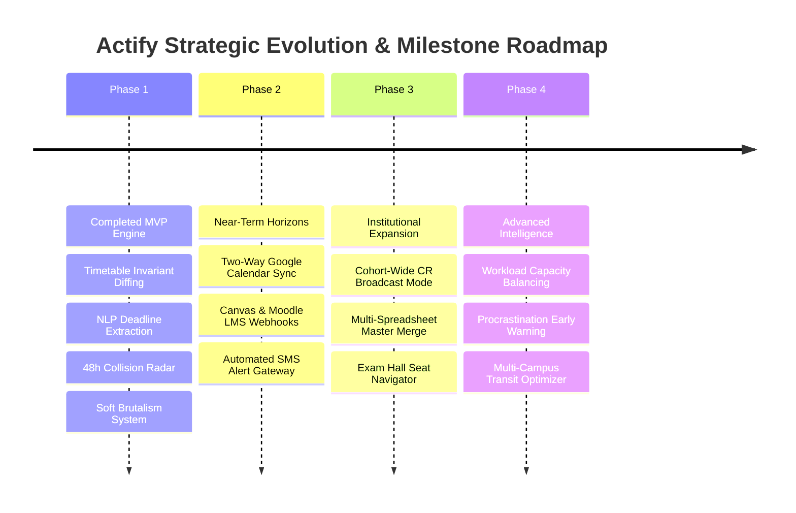

- **Phase 1 (Completed)**: Core dual-feature implementation for both problem statements; robust deterministic diffing, Gemini 2.0 Flash extraction, 48-hour collision detection, and Soft Brutalism user interface.
- **Phase 2 (Upcoming)**: Automated bidirectional synchronization with Google Calendar, Microsoft Outlook, and Apple iCal via standard CalDAV protocols. Direct LMS webhooks for Canvas, Blackboard, and Moodle.
- **Phase 3 (Enterprise)**: Dedicated Class Representative Portal enabling cohort-wide verification and instant push notifications for room relocations.
- **Phase 4 (Predictive Intelligence)**: Personalized workload capacity modeling that balances study hours based on individual subject proficiency and historical exam velocity.

---

## 🚦 Operational Runbook & Execution Guide

### End-to-End Workflow 1: Timetable Revision Verification
1. **Spreadsheet Upload**: Navigate to the Timetable Diff Module via the top navigation bar.
2. **File Selection**: Select `Previous Timetable (.csv/.xlsx)` in Zone A and `Revised Timetable (.csv/.xlsx)` in Zone B.
3. **Execution**: Click **Run Differential Analysis**. The backend ingests both tabular arrays, normalizes column labels, and computes invariant composite hashes.
4. **Disambiguation Inspection**: If non-identical facility names are detected (e.g., `Comp Lab 1` vs `Computer Laboratory 01`), review the confidence rating in the Disambiguation Modal and confirm or reject equivalence.
5. **Faceted Filtering**: Utilize the Course Code dropdown to isolate personal courses (e.g., `CS201`) or Section toggles (`Sec A`).
6. **Export & Sync**: Click **Export Filtered Schedule Delta** to generate a clean briefing sheet for your cohort or personal calendar.

### End-to-End Workflow 2: Multi-Announcement Deadline Collision Ingestion
1. **Corpus Ingestion**: Navigate to the Deadline Radar Terminal on the Dashboard.
2. **Text Ingestion**: Paste up to 6 unstructured announcements or assignment briefs into the ingestion buffer.
3. **NLP Processing**: Trigger **Extract Deadlines via Gemini 2.0 Flash**. The engine anchors relative dates to the current system timestamp and extracts standardized ISO-8601 deadlines with verbatim citations.
4. **Verification & Audit**: Review the generated deadline ledger. Verify that the verbatim citation quotes accurately match the intent of your course instructors. Click any row to fine-tune times if necessary.
5. **Collision Identification**: The deterministic sliding-window algorithm automatically evaluates whether 3 or more submissions fall within 48 hours.
6. **Mitigation**: If a High-Risk Collision Cluster is highlighted, review the aggregated deliverable breakdown to proactively schedule early preparation milestones.

---

## 🏆 Project Delivery & Team DeepStack Attribution

Actify was designed, engineered, and documented by **Team DeepStack** for the GDG Nirmana Hackathon.

```
       ===================================================================
                                 TEAM DEEPSTACK
       ===================================================================
       * Suryansh Singh     - System Architect & Full-Stack Lead
       * Vikas Patel        - Core Backend & Algorithm Engineer
       * Shivam Jaiswal     - UI/UX & Frontend Lead
       * Prince Mishra      - AI Systems & NLP Specialist
       ===================================================================
                         EMPOWERING ACADEMIC EXCELLENCE
```

> [!NOTE]
> Actify represents our commitment to rigorous engineering, deterministic software reliability, and human-centered design for students worldwide.
